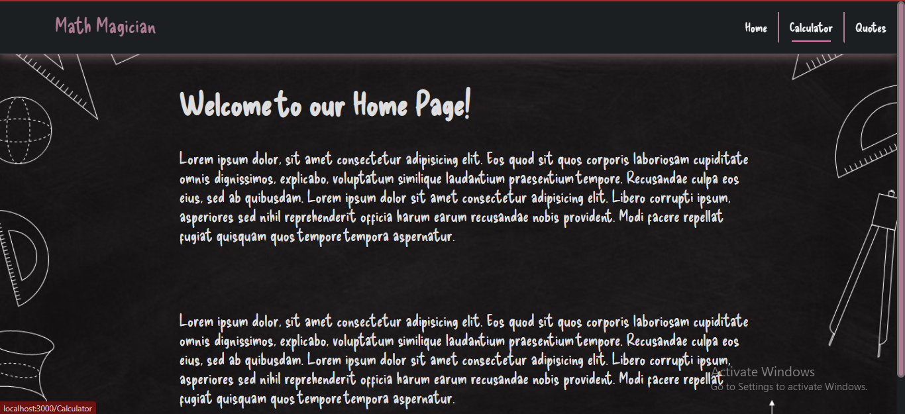

# Math-Magician
<a name="readme-top"></a>

<div align="center">
  
  <br/>

  <h3><b>Math Magician Project</b></h3>

</div>

# 📗 Table of Contents

- [📖 About the Project](#about-project)
  - [🛠 Built With](#built-with)
    - [Tech Stack](#tech-stack)
    - [Key Features](#key-features)
  - [🚀 Live Demo](#live-demo)
- [💻 Getting Started](#getting-started)
  - [Setup](#setup)
  - [Prerequisites](#prerequisites)
  - [Install](#install)
  - [Usage](#usage)
  - [Run tests](#run-tests)
  - [Deployment](#triangular_flag_on_post-deployment)
- [👥 Authors](#authors)
- [🔭 Future Features](#future-features)
- [🤝 Contributing](#contributing)s
- [⭐️ Show your support](#support)
- [🙏 Acknowledgements](#acknowledgements)
- [📝 License](#license)

# 📖 math-magician <a name="about-project"></a>

**Math Magician Project** is a simple Project built through react npx create-react-app. User can interact by performing the calculator functions. In future versions there is going to complete website version of math magician Project will be developed using react components. 

## 🛠 Built With <a name="built-with"></a>

HTML CSS JavaScript React and redux

### Tech Stack <a name="tech-stack"></a>

### Key Features <a name="key-features"></a>

- **[html css with JavaScript and React ]**

<p align="right">(<a href="#readme-top">back to top</a>)</p>

## 🚀 Live Demo <a name="live-demo"> </a>

- [Live Demo](https://math-magician-website-ppor.onrender.com)


<p align="right">(<a href="#readme-top">back to top</a>)</p>

## 💻 Getting Started <a name="getting-started"></a>

To get a local copy up and running, follow these steps.

### Prerequisites
Web Browser, Code Editor.

### Setup

Clone this repository to your desired folder:

Example commands:

```sh
  cd Math-Magician-Setup
  git clone git@github.com:Kel-nana/math-magician-setup.git
```

### Install
VS CODE, Dev Dependencies (Linters), npm Package Manager, Webpack and Jest (for unit testing)

### Usage
Able to perform calculator operations and navigate through available links 

### Run tests
Able to perform calculator operations and navigate through available links 

### Deployment
The Project has been deployed in the link below.

<p align="right">(<a href="#readme-top">back to top</a>)</p>

## 👥 Author <a name="authors"></a>

👤 **Kelvin Irungu**

- GitHub: [@Kel-nana](https://github.com/Kel-nana)
- Linkedin: [@kelvin-irungu](https://www.linkedin.com/in/kelvin-irungu-838923249/)
- Twitter: [@kelvin-irungu](https://twitter.com/home)


<p align="right">(<a href="#readme-top">back to top</a>)</p>

## 🔭 Future Features <a name="future-features"></a>

- [ ] **[Functionality of calculator operations will be implemented using components. Going forward complete UI website will be developed with three links to navigate i.e Home Calculator and Quote.**

<p align="right">(<a href="#readme-top">back to top</a>)</p>

## 🤝 Contributing <a name="contributing"></a>

Contributions, issues, and feature requests are welcome!

<p align="right">(<a href="#readme-top">back to top</a>)</p>

## ⭐️ Show your support <a name="support"></a>

If you like this project please consider leaving a review.

<p align="right">(<a href="#readme-top">back to top</a>)</p>

## 🙏 Acknowledgments <a name="acknowledgements"></a>

I would like to thank my coding partner [Abdul Ali and Zike]. 

<p align="right">(<a href="#readme-top">back to top</a>)</p>

## 📝 License <a name="license"></a>

This project is [MIT](https://github.com/Kel-nana/math-magician-setup/blob/setup-branch/LICENSE) licensed.

<p align="right">(<a href="#readme-top">back to top</a>)</p>
<a name="readme-top"></a>